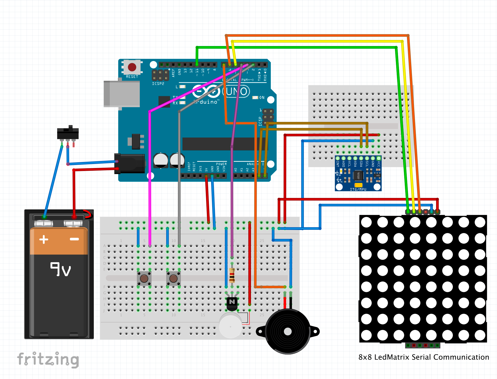
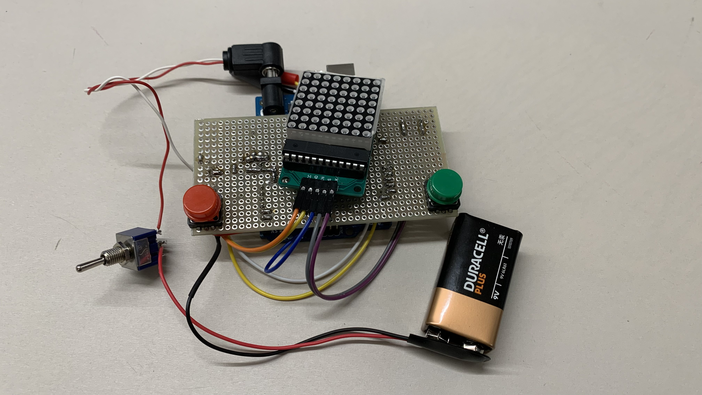
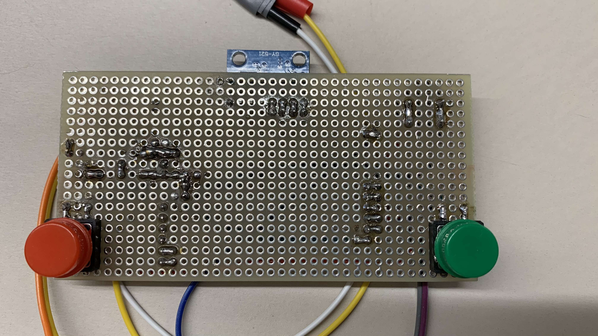
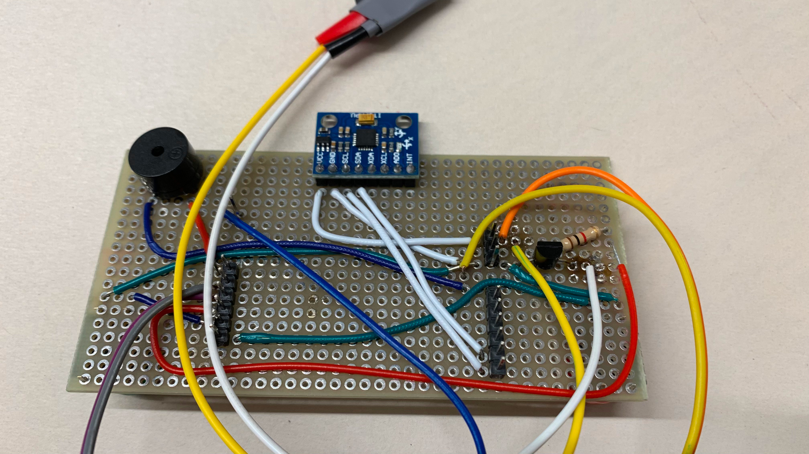

# Snek Arduino Game

## Gameplay (logic + controls)

When starting the game, first the gyroscope is being calibrated. While this is happening an hour glass is shown so that the player know that he needs to wait shortly. When done, it will play a short jingle and prompt the mode selection screen.

The game has two game modes: Mode 1 for the classic snake game, mode 2 for a harder version that involves obstacles that the player needs to avoid.

The green button is used for choosing the game mode and starting the game, the red button can be used to quit a running game.

The movement is controlled by tilting the device into different directions. If the snek dies, a final animation will be played, representing the total length of the snek, before the score is being displayed.

Every time the snek eats a food, the buzzer plays a tone. During the final animation the game case vibrates to indicate that the game is over. Upon displaying the score one of two melodies is played: A happy melody if a new highscore has been reached and a sad one if not.

## Hardware schematic (Fritzing)

The fritzing file can be found here: `schematics/snek-project.fzz`

## Hardware (Soldered version)

To make the game more usable and enjoyable we soldered our components to a prototyping breadboard which can be plugged on top of an Arduino, thus creating SnekShield™.

## 3D case files

We designed and 3D-printed a case to hold the Arduino, the power supply (a 9V battery) and the SnekShield™. The case consists of three parts, the .stl files can be found in `schematics/3d-case/`. The different parts then need to be screwed together using 8 3x12mm screws.

## Items used

- Arduino Uno
- MPU 6050 Gyroscope
- MAX7219 serial interface for 8x8 LED Dot matrix
- BC337 Transistor
- Vibration motor
- Buzzer
- Two Buttons
- 1 kΩ resistor

## How to compile and upload the code to Arduino

The source code is organised using the PlatformIO extension for VS Code. Therefore, just open this folder (the one that holds the `platformio.ini` file) in VS Code and then the extension should be able to build and upload the program to the board.

Otherwise, for using the Arduino IDE, move the files from the `src` folder into a folder called `Snak_Arduino` and open the `Snak_Arduino.ino` file in the IDE. Then, also the necessary libraries need to be installed. They can be found in the `platformio.ini` file in the `lib_deps` section.
